# Card Corner — Crafting Guide

A simple crafting guide for Card Corner, showing what items to hold onto for crafting and what ingredients create which items.

After reaching level 100 you unlock crafting. Clicking on this menu item will allow you to combine two pieces of loot on the floor to make an even stronger piece of loot if they're part of a crafting recipe.

⚠️Items must be on the ground to be used in crafting, items equipped in any loot loadout will not be usable and must be dropped.

You can track items found, crafted, and recipes in your compendium.

## Table of contents

- [Ingredient items](#ingredient-items)
- [Crafted items](#crafted-items)
- [Craft progression](#craft-progression)
  - [Ammo](#ammo)
  - [Angler Fish](#angler-fish)
  - [Azure Blade](#azure-blade)
  - [Black Blade](#black-blade)
  - [Blue Staff](#blue-staff)
  - [Butterfly](#butterfly)
  - [Carbon Compass](#carbon-compass)
  - [Carbon Cuirass](#carbon-cuirass)
  - [Dragvandil](#dragvandil)
  - [Earth Staff](#earth-staff)
  - [Engine Key](#engine-key)
  - [Exalted Excalibur](#exalted-excalibur)
  - [Flame Staff](#flame-staff)
  - [Galactic Book](#galactic-book)
  - [Galactic Bracelet](#galactic-bracelet)
  - [Gold Dice](#gold-dice)
  - [Green Staff](#green-staff)
  - [Ice Staff](#ice-staff)
  - [Jack's Gloves](#jack-s-gloves)
  - [King's Gloves](#king-s-gloves)
  - [Orange Blade](#orange-blade)
  - [Plated Coin](#plated-coin)
  - [Pocket Watch](#pocket-watch)
  - [Pridwen](#pridwen)
  - [Purple Staff](#purple-staff)
  - [Queen's Gloves](#queen-s-gloves)
  - [Red Blade](#red-blade)
  - [Regal Container](#regal-container)
  - [Royal Axe](#royal-axe)
  - [Seeing Stone](#seeing-stone)
  - [Thunder Essence](#thunder-essence)
  - [Trap](#trap)
  - [Vampire Jaws](#vampire-jaws)
  - [White Blade](#white-blade)
  - [Wind Staff](#wind-staff)
  - [Yellow Blade](#yellow-blade)

## Ingredient items

Hold onto these items when they appear — they are used as crafting ingredients.

| Item | Used to craft |
| --- | --- |
| 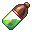 Acid Battery | Quantum Battery |
| 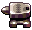 Anvil | Dragvandil, Earth Staff, Flame Staff, Gold Dice, Ice Staff, Saber, Tungsten Weight, Wind Staff |
|  Azure Gem | Azure Blade |
|  Azure Tear | Azure Blade |
| 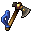 Bearded Axe | Royal Axe |
| 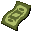 Bill | Plated Coin |
| 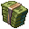 Bill Stack | Plated Coin |
|  Black Gem | Black Blade |
|  Black Pearl | Black Blade |
| 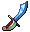 Blue Blade | Blue Staff |
|  Blue Compass | Carbon Compass |
|  Blue Flame | Blue Staff |
|  Blue Gem | Blue Blade |
|  Blue Pearl | Blue Blade |
| 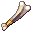 Bone Club | Saber |
| 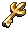 Captain's Key | Trap |
| 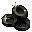 Carbon Chips | Carbon Cuirass |
| 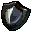 Carbon Shield | Carbon Cuirass |
| 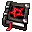 Cursed Book | Galactic Book |
| 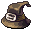 Earth Hat | Earth Skull |
| 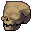 Earth Skull | Earth Staff |
| 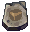 Earth Tablet | Earth Skull |
| 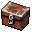 Engine Parts | Engine Key |
| 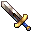 Excalibur | Exalted Excalibur |
| 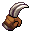 Fighting Claws | Thunder Essence |
| 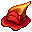 Flame Hat | Flame Skull |
| 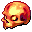 Flame Skull | Flame Staff |
| 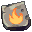 Flame Tablet | Flame Skull |
| 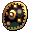 Forged Shield | Spirit Shield |
| 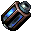 Fusion Reactor | Quantum Battery |
| 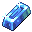 Glass Ingot | Butterfly |
| 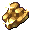 Gold Bits | Queen's Gloves |
| 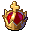 Gold Crown | Seeing Stone |
|  Golden Clock | Pocket Watch |
|  Green Blade | Green Staff |
|  Green Compass | Carbon Compass |
|  Green Flame | Green Staff |
|  Green Gem | Green Blade |
|  Green Pearl | Green Blade |
| 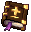 Holy Book | Galactic Book, Thurible |
| 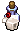 Holy Water | Thurible |
| 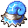 Ice Hat | Ice Skull |
| 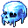 Ice Skull | Ice Staff |
| 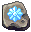 Ice Tablet | Ice Skull |
| 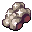 Iron Bits | Jack's Gloves |
| 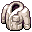 Jack's Attire | Jack's Gloves |
| 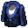 King's Attire | King's Gloves |
| 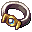 Kingly Bracelet | Galactic Bracelet |
| 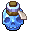 Life Container | Regal Container, Spirit Shield |
|  Life Root | Vampire Jaws |
| 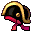 Naval Hat | Ammo |
| 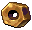 Nut | Engine Key |
| 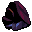 Obsidian Bits | King's Gloves, Tungsten Weight |
|  Orange Gem | Orange Blade |
|  Orange Pearl | Orange Blade |
|  Power Bracelet | Galactic Bracelet |
| 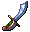 Prismatic Blade | Excalibur |
| 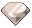 Prismatic Diamond | Prismatic Blade |
| 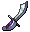 Purple Blade | Purple Staff |
| 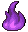 Purple Flame | Purple Staff |
|  Purple Gem | Purple Blade |
|  Purple Pearl | Purple Blade |
| 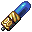 Quantum Battery | Trap |
| 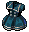 Queen's Attire | Queen's Gloves |
| 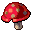 Red Cap | Regal Container, Vampire Jaws |
|  Red Gem | Red Blade |
|  Red Pearl | Red Blade |
| 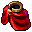 Regal Robes | Seeing Stone |
| 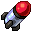 Rocket Engine | Ammo |
| 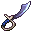 Saber | Excalibur |
|  Silver Clock | Pocket Watch |
|  Spirit Shield | Pridwen |
| 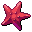 Starfish | Angler Fish, Butterfly |
| 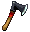 Survival Axe | Royal Axe |
|  Thunder Rod | Thunder Essence |
|  Thurible | Exalted Excalibur |
|  Tungsten Weight | Pridwen |
|  Unforged Blade | Dragvandil, Prismatic Blade |
|  Urchin | Angler Fish |
|  Weighted Dice | Gold Dice |
|  White Gem | White Blade |
|  White Pearl | White Blade |
|  Wind Hat | Wind Skull |
|  Wind Skull | Wind Staff |
|  Wind Tablet | Wind Skull |
|  Yellow Gem | Unforged Blade, Yellow Blade |
|  Yellow Pearl | Unforged Blade, Yellow Blade |

## Crafted items

This is a list of items that must be crafted. Some of the items are used to further craft other items.

| Crafted item | Ingredient 1 | Ingredient 2 |
| --- | --- | --- |
|  Ammo | Naval Hat | Rocket Engine |
|  Angler Fish | Urchin | Starfish |
|  Azure Blade | Azure Tear | Azure Gem |
|  Black Blade | Black Gem | Black Pearl |
|  Blue Blade | Blue Gem | Blue Pearl |
|  Blue Staff | Blue Flame | Blue Blade |
|  Butterfly | Glass Ingot | Starfish |
|  Carbon Compass | Green Compass | Blue Compass |
|  Carbon Cuirass | Carbon Shield | Carbon Chips |
|  Dragvandil | Unforged Blade | Anvil |
|  Earth Skull | Earth Hat | Earth Tablet |
|  Earth Staff | Earth Skull | Anvil |
|  Engine Key | Engine Parts | Nut |
|  Exalted Excalibur | Excalibur | Thurible |
|  Excalibur | Prismatic Blade | Saber |
|  Flame Skull | Flame Hat | Flame Tablet |
|  Flame Staff | Flame Skull | Anvil |
|  Galactic Book | Holy Book | Cursed Book |
|  Galactic Bracelet | Kingly Bracelet | Power Bracelet |
|  Gold Dice | Weighted Dice | Anvil |
|  Green Blade | Green Gem | Green Pearl |
|  Green Staff | Green Flame | Green Blade |
|  Ice Skull | Ice Hat | Ice Tablet |
|  Ice Staff | Ice Skull | Anvil |
|  Jack's Gloves | Jack's Attire | Iron Bits |
|  King's Gloves | King's Attire | Obsidian Bits |
|  Orange Blade | Orange Gem | Orange Pearl |
|  Plated Coin | Bill | Bill Stack |
|  Pocket Watch | Golden Clock | Silver Clock |
|  Pridwen | Spirit Shield | Tungsten Weight |
|  Prismatic Blade | Unforged Blade | Prismatic Diamond |
|  Purple Blade | Purple Pearl | Purple Gem |
|  Purple Staff | Purple Flame | Purple Blade |
|  Quantum Battery | Fusion Reactor | Acid Battery |
|  Queen's Gloves | Queen's Attire | Gold Bits |
|  Red Blade | Red Gem | Red Pearl |
|  Regal Container | Life Container | Red Cap |
|  Royal Axe | Survival Axe | Bearded Axe |
|  Saber | Bone Club | Anvil |
|  Seeing Stone | Regal Robes | Gold Crown |
|  Spirit Shield | Forged Shield | Life Container |
|  Thunder Essence | Thunder Rod | Fighting Claws |
|  Thurible | Holy Water | Holy Book |
|  Trap | Quantum Battery | Captain's Key |
|  Tungsten Weight | Anvil | Obsidian Bits |
|  Unforged Blade | Yellow Pearl | Yellow Gem |
|  Vampire Jaws | Life Root | Red Cap |
|  White Blade | White Pearl | White Gem |
|  Wind Skull | Wind Hat | Wind Tablet |
|  Wind Staff | Wind Skull | Anvil |
|  Yellow Blade | Yellow Pearl | Yellow Gem |

## Craft progression

Each diagram shows recipe steps for one path to a final crafted item. Arrows run from ingredients toward the item they combine into.

### Ammo

 **Naval Hat**
 **Rocket Engine**
 **Ammo**


### Angler Fish

 **Urchin**
 **Starfish**
 **Angler Fish**


### Azure Blade

 **Azure Tear**
 **Azure Gem**
 **Azure Blade**


### Black Blade

 **Black Gem**
 **Black Pearl**
 **Black Blade**


### Blue Staff

 **Blue Flame**
 **Blue Gem**
 **Blue Pearl**
 **Blue Blade**
 **Blue Staff**


### Butterfly

 **Glass Ingot**
 **Starfish**
 **Butterfly**


### Carbon Compass

 **Green Compass**
 **Blue Compass**
 **Carbon Compass**


### Carbon Cuirass

 **Carbon Shield**
 **Carbon Chips**
 **Carbon Cuirass**


### Dragvandil

 **Yellow Pearl**
 **Yellow Gem**
 **Unforged Blade**
 **Anvil**
 **Dragvandil**


### Earth Staff

 **Earth Hat**
 **Earth Tablet**
 **Earth Skull**
 **Anvil**
 **Earth Staff**


### Engine Key

 **Engine Parts**
 **Nut**
 **Engine Key**


### Exalted Excalibur

 **Yellow Pearl**
 **Yellow Gem**
 **Unforged Blade**
 **Prismatic Diamond**
 **Prismatic Blade**
 **Bone Club**
 **Anvil**
 **Saber**
 **Excalibur**
 **Holy Water**
 **Holy Book**
 **Thurible**
 **Exalted Excalibur**


### Flame Staff

 **Flame Hat**
 **Flame Tablet**
 **Flame Skull**
 **Anvil**
 **Flame Staff**


### Galactic Book

 **Holy Book**
 **Cursed Book**
 **Galactic Book**


### Galactic Bracelet

 **Kingly Bracelet**
 **Power Bracelet**
 **Galactic Bracelet**


### Gold Dice

 **Weighted Dice**
 **Anvil**
 **Gold Dice**


### Green Staff

 **Green Flame**
 **Green Gem**
 **Green Pearl**
 **Green Blade**
 **Green Staff**


### Ice Staff

 **Ice Hat**
 **Ice Tablet**
 **Ice Skull**
 **Anvil**
 **Ice Staff**


### Jack's Gloves

 **Jack's Attire**
 **Iron Bits**
 **Jack's Gloves**


### King's Gloves

 **King's Attire**
 **Obsidian Bits**
 **King's Gloves**


### Orange Blade

 **Orange Gem**
 **Orange Pearl**
 **Orange Blade**

```mermaid
flowchart TD
  orange_gem["Orange Gem"]
  orange_pearl["Orange Pearl"]
  orange_blade["Orange Blade"]
  orange_gem --> orange_blade
  orange_pearl --> orange_blade
```

### Plated Coin

 **Bill**
 **Bill Stack**
 **Plated Coin**

```mermaid
flowchart TD
  bill["Bill"]
  bill_stack["Bill Stack"]
  plated_coin["Plated Coin"]
  bill --> plated_coin
  bill_stack --> plated_coin
```

### Pocket Watch

 **Golden Clock**
 **Silver Clock**
 **Pocket Watch**

```mermaid
flowchart TD
  golden_clock["Golden Clock"]
  silver_clock["Silver Clock"]
  pocket_watch["Pocket Watch"]
  golden_clock --> pocket_watch
  silver_clock --> pocket_watch
```

### Pridwen

 **Forged Shield**
 **Life Container**
 **Spirit Shield**
 **Anvil**
 **Obsidian Bits**
 **Tungsten Weight**
 **Pridwen**

```mermaid
flowchart TD
  forged_shield["Forged Shield"]
  life_container["Life Container"]
  spirit_shield["Spirit Shield"]
  anvil["Anvil"]
  obsidian_bits["Obsidian Bits"]
  tungsten_weight["Tungsten Weight"]
  pridwen["Pridwen"]
  anvil --> tungsten_weight
  forged_shield --> spirit_shield
  life_container --> spirit_shield
  obsidian_bits --> tungsten_weight
  spirit_shield --> pridwen
  tungsten_weight --> pridwen
```

### Purple Staff

 **Purple Flame**
 **Purple Pearl**
 **Purple Gem**
 **Purple Blade**
 **Purple Staff**

```mermaid
flowchart TD
  purple_flame["Purple Flame"]
  purple_pearl["Purple Pearl"]
  purple_gem["Purple Gem"]
  purple_blade["Purple Blade"]
  purple_staff["Purple Staff"]
  purple_blade --> purple_staff
  purple_flame --> purple_staff
  purple_gem --> purple_blade
  purple_pearl --> purple_blade
```

### Queen's Gloves

 **Queen's Attire**
 **Gold Bits**
 **Queen's Gloves**

```mermaid
flowchart TD
  queen_s_attire["Queen's Attire"]
  gold_bits["Gold Bits"]
  queen_s_gloves["Queen's Gloves"]
  gold_bits --> queen_s_gloves
  queen_s_attire --> queen_s_gloves
```

### Red Blade

 **Red Gem**
 **Red Pearl**
 **Red Blade**

```mermaid
flowchart TD
  red_gem["Red Gem"]
  red_pearl["Red Pearl"]
  red_blade["Red Blade"]
  red_gem --> red_blade
  red_pearl --> red_blade
```

### Regal Container

 **Life Container**
 **Red Cap**
 **Regal Container**

```mermaid
flowchart TD
  life_container["Life Container"]
  red_cap["Red Cap"]
  regal_container["Regal Container"]
  life_container --> regal_container
  red_cap --> regal_container
```

### Royal Axe

 **Survival Axe**
 **Bearded Axe**
 **Royal Axe**

```mermaid
flowchart TD
  survival_axe["Survival Axe"]
  bearded_axe["Bearded Axe"]
  royal_axe["Royal Axe"]
  bearded_axe --> royal_axe
  survival_axe --> royal_axe
```

### Seeing Stone

 **Regal Robes**
 **Gold Crown**
 **Seeing Stone**

```mermaid
flowchart TD
  regal_robes["Regal Robes"]
  gold_crown["Gold Crown"]
  seeing_stone["Seeing Stone"]
  gold_crown --> seeing_stone
  regal_robes --> seeing_stone
```

### Thunder Essence

 **Thunder Rod**
 **Fighting Claws**
 **Thunder Essence**

```mermaid
flowchart TD
  thunder_rod["Thunder Rod"]
  fighting_claws["Fighting Claws"]
  thunder_essence["Thunder Essence"]
  fighting_claws --> thunder_essence
  thunder_rod --> thunder_essence
```

### Trap

 **Fusion Reactor**
 **Acid Battery**
 **Quantum Battery**
 **Captain's Key**
 **Trap**

```mermaid
flowchart TD
  fusion_reactor["Fusion Reactor"]
  acid_battery["Acid Battery"]
  quantum_battery["Quantum Battery"]
  captain_s_key["Captain's Key"]
  trap["Trap"]
  acid_battery --> quantum_battery
  fusion_reactor --> quantum_battery
  quantum_battery --> trap
  captain_s_key --> trap
```

### Vampire Jaws

 **Life Root**
 **Red Cap**
 **Vampire Jaws**

```mermaid
flowchart TD
  life_root["Life Root"]
  red_cap["Red Cap"]
  vampire_jaws["Vampire Jaws"]
  life_root --> vampire_jaws
  red_cap --> vampire_jaws
```

### White Blade

 **White Pearl**
 **White Gem**
 **White Blade**

```mermaid
flowchart TD
  white_pearl["White Pearl"]
  white_gem["White Gem"]
  white_blade["White Blade"]
  white_gem --> white_blade
  white_pearl --> white_blade
```

### Wind Staff

 **Wind Hat**
 **Wind Tablet**
 **Wind Skull**
 **Anvil**
 **Wind Staff**

```mermaid
flowchart TD
  wind_hat["Wind Hat"]
  wind_tablet["Wind Tablet"]
  wind_skull["Wind Skull"]
  anvil["Anvil"]
  wind_staff["Wind Staff"]
  wind_hat --> wind_skull
  wind_skull --> wind_staff
  anvil --> wind_staff
  wind_tablet --> wind_skull
```

### Yellow Blade

 **Yellow Pearl**
 **Yellow Gem**
 **Yellow Blade**

```mermaid
flowchart TD
  yellow_pearl["Yellow Pearl"]
  yellow_gem["Yellow Gem"]
  yellow_blade["Yellow Blade"]
  yellow_gem --> yellow_blade
  yellow_pearl --> yellow_blade
```
