# Desktop Defender — Crafting Guide

> **Disclaimer:** This is a crafting reference only. It was derived from extracted game data and does not include drop rates, inventory advice, or full item stats. Game content is likely the property of the rights holders listed in [README.md](README.md).

## Items to keep (ingredients)

Hold onto these items when they appear — they are used as crafting ingredients.

<table>
<thead><tr><th>Item</th><th>Used to craft</th></tr></thead>
<tbody>
<tr><td> Aerodynamics</td><td>Matterless Arrows</td></tr>
<tr><td> Angel Knowledge</td><td>Enlightenment</td></tr>
<tr><td> Aura</td><td>No Pain</td></tr>
<tr><td> Big Bang</td><td>Nucleus</td></tr>
<tr><td> Carved Arrows</td><td>Matterless Arrows</td></tr>
<tr><td> Clean Waters</td><td>No Pain</td></tr>
<tr><td> Deity Axe</td><td>Deity Staff, Moulded Blade</td></tr>
<tr><td> Deity Saber</td><td>Deity Staff</td></tr>
<tr><td> Deity Staff</td><td>Moulded Deity</td></tr>
<tr><td> Demon</td><td>Demon's Sword</td></tr>
<tr><td> Demon's Sword</td><td>Control</td></tr>
<tr><td> Dragonborn</td><td>Dragonmade</td></tr>
<tr><td> Druid's Sword</td><td>Demon's Sword</td></tr>
<tr><td> Enlightenment</td><td>Peace, Phoenix</td></tr>
<tr><td> Expansion</td><td>Multiplication</td></tr>
<tr><td> Experiment</td><td>Final Experiment, Rabid Beast</td></tr>
<tr><td> Failed Experiment</td><td>Final Experiment</td></tr>
<tr><td> Final Experiment</td><td>Coup de Grâce, Sword de Grâce</td></tr>
<tr><td> Fruit Reaper</td><td>Sleight of Hand</td></tr>
<tr><td> Golem</td><td>Golemification</td></tr>
<tr><td> Heavy Equipment</td><td>Light Mace</td></tr>
<tr><td> Higgs Field</td><td>Boson</td></tr>
<tr><td> Jupiter</td><td>Higgs Field</td></tr>
<tr><td> Learning Dew</td><td>Peace</td></tr>
<tr><td> Love</td><td>Passion</td></tr>
<tr><td> Lust</td><td>Passion</td></tr>
<tr><td> Materials</td><td>Multiplication</td></tr>
<tr><td> Moulded Blade</td><td>Moulded Deity</td></tr>
<tr><td> Moulded Will</td><td>Moulded Lightning</td></tr>
<tr><td> Moulding Lava</td><td>Moulded Blade</td></tr>
<tr><td> Multiblast</td><td>Multigash</td></tr>
<tr><td> Multishot</td><td>Multiblast</td></tr>
<tr><td> Musical Inspiration</td><td>Light Mace</td></tr>
<tr><td> No Control</td><td>Control, Rabid Beast</td></tr>
<tr><td> Pushing Flow</td><td>Storm Glove</td></tr>
<tr><td> Rich Ghost</td><td>Sleight of Hand</td></tr>
<tr><td> Rune Mastery</td><td>Multigash</td></tr>
<tr><td> Sapiens</td><td>Enlightenment</td></tr>
<tr><td> Sharp Shot</td><td>Coup de Grâce</td></tr>
<tr><td> Sleight of Hand</td><td>Phoenix</td></tr>
<tr><td> Trident</td><td>Sword de Grâce</td></tr>
<tr><td> Ultimate Water Mend</td><td>Holy Water Mend</td></tr>
<tr><td> Water Mend</td><td>Holy Water Mend, Ultimate Water Mend</td></tr>
<tr><td> Wind Glove</td><td>Storm Glove</td></tr>
<tr><td> Wind Golem</td><td>Golemification</td></tr>
<tr><td> Wizardry</td><td>Multiblast</td></tr>
</tbody>
</table>

## Crafted items

<table>
<thead><tr><th>Crafted item</th><th>Material 1</th><th>Material 2</th></tr></thead>
<tbody>
<tr><td> Boson</td><td>Higgs Field</td><td>Higgs Field</td></tr>
<tr><td> Control</td><td>Demon's Sword</td><td>No Control</td></tr>
<tr><td> Coup de Grâce</td><td>Final Experiment</td><td>Sharp Shot</td></tr>
<tr><td> Deity Staff</td><td>Deity Axe</td><td>Deity Saber</td></tr>
<tr><td> Demon's Sword</td><td>Demon</td><td>Druid's Sword</td></tr>
<tr><td> Dragonmade</td><td>Dragonborn</td><td>Dragonborn</td></tr>
<tr><td> Enlightenment</td><td>Sapiens</td><td>Angel Knowledge</td></tr>
<tr><td> Final Experiment</td><td>Failed Experiment</td><td>Experiment</td></tr>
<tr><td> Golemification</td><td>Wind Golem</td><td>Golem</td></tr>
<tr><td> Higgs Field</td><td>Jupiter</td><td>Jupiter</td></tr>
<tr><td> Holy Water Mend</td><td>Water Mend</td><td>Ultimate Water Mend</td></tr>
<tr><td> Light Mace</td><td>Musical Inspiration</td><td>Heavy Equipment</td></tr>
<tr><td> Matterless Arrows</td><td>Aerodynamics</td><td>Carved Arrows</td></tr>
<tr><td> Moulded Blade</td><td>Deity Axe</td><td>Moulding Lava</td></tr>
<tr><td> Moulded Deity</td><td>Moulded Blade</td><td>Deity Staff</td></tr>
<tr><td> Moulded Lightning</td><td>Moulded Will</td><td>Moulded Will</td></tr>
<tr><td> Multiblast</td><td>Wizardry</td><td>Multishot</td></tr>
<tr><td> Multigash</td><td>Multiblast</td><td>Rune Mastery</td></tr>
<tr><td> Multiplication</td><td>Expansion</td><td>Materials</td></tr>
<tr><td> No Pain</td><td>Aura</td><td>Clean Waters</td></tr>
<tr><td> Nucleus</td><td>Big Bang</td><td>Big Bang</td></tr>
<tr><td> Passion</td><td>Love</td><td>Lust</td></tr>
<tr><td> Peace</td><td>Enlightenment</td><td>Learning Dew</td></tr>
<tr><td> Phoenix</td><td>Enlightenment</td><td>Sleight of Hand</td></tr>
<tr><td> Rabid Beast</td><td>Experiment</td><td>No Control</td></tr>
<tr><td> Sleight of Hand</td><td>Rich Ghost</td><td>Fruit Reaper</td></tr>
<tr><td> Storm Glove</td><td>Pushing Flow</td><td>Wind Glove</td></tr>
<tr><td> Sword de Grâce</td><td>Final Experiment</td><td>Trident</td></tr>
<tr><td> Ultimate Water Mend</td><td>Water Mend</td><td>Water Mend</td></tr>
</tbody>
</table>

## Craft progression

Each diagram shows recipe steps for one path to a final crafted item. Arrows run from ingredients toward the item they combine into.

### Jupiter → Higgs Field → Boson

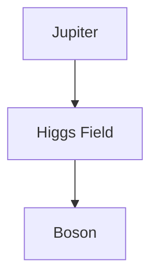

-  **Jupiter**
-  **Higgs Field**
-  **Boson**

### Demon → Druid's Sword → Demon's Sword → No Control → Control

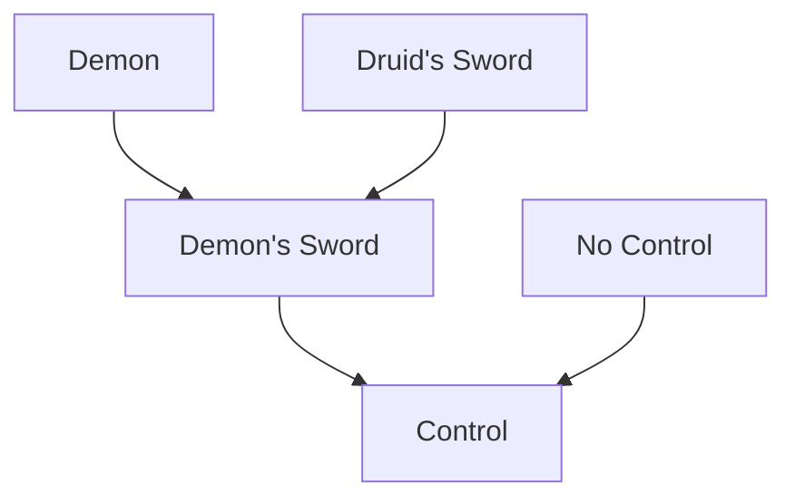

-  **Demon**
-  **Druid's Sword**
-  **Demon's Sword**
-  **No Control**
-  **Control**

### Failed Experiment → Experiment → Final Experiment → Sharp Shot → Coup de Grâce

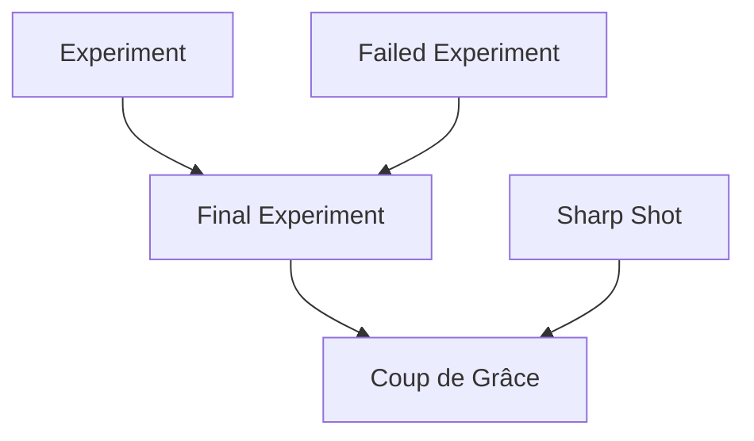

-  **Failed Experiment**
-  **Experiment**
-  **Final Experiment**
-  **Sharp Shot**
-  **Coup de Grâce**

### Dragonborn → Dragonmade

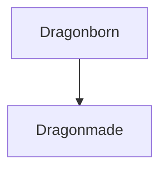

-  **Dragonborn**
-  **Dragonmade**

### Wind Golem → Golem → Golemification

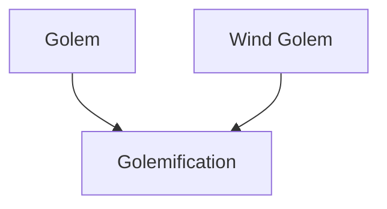

-  **Wind Golem**
-  **Golem**
-  **Golemification**

### Water Mend → Ultimate Water Mend → Holy Water Mend

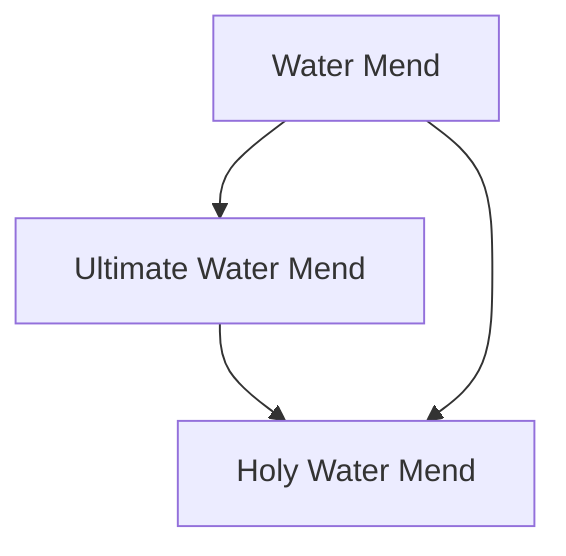

-  **Water Mend**
-  **Ultimate Water Mend**
-  **Holy Water Mend**

### Musical Inspiration → Heavy Equipment → Light Mace

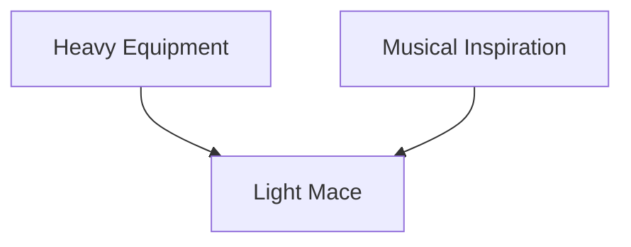

-  **Musical Inspiration**
-  **Heavy Equipment**
-  **Light Mace**

### Aerodynamics → Carved Arrows → Matterless Arrows

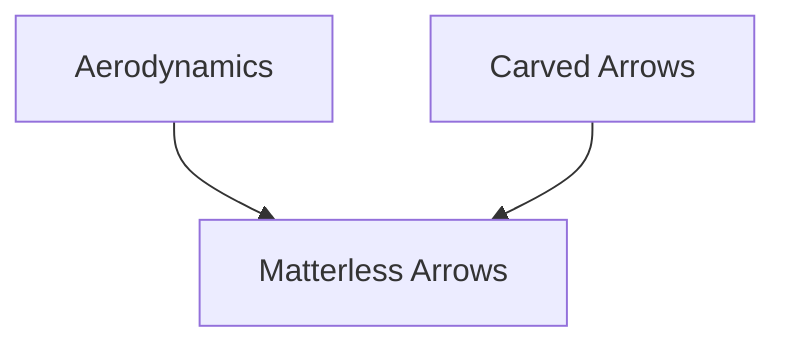

-  **Aerodynamics**
-  **Carved Arrows**
-  **Matterless Arrows**

### Deity Axe → Moulding Lava → Moulded Blade → Deity Axe → Deity Saber → Deity Staff → Moulded Deity

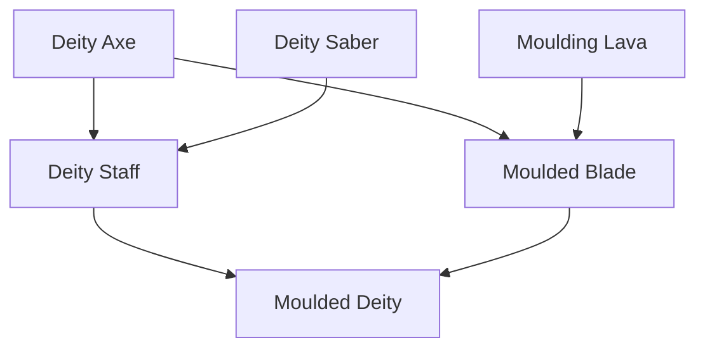

-  **Deity Axe**
-  **Moulding Lava**
-  **Moulded Blade**
-  **Deity Saber**
-  **Deity Staff**
-  **Moulded Deity**

### Moulded Will → Moulded Lightning

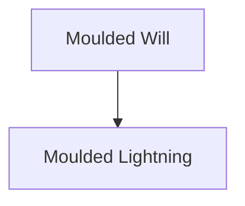

-  **Moulded Will**
-  **Moulded Lightning**

### Wizardry → Multishot → Multiblast → Rune Mastery → Multigash

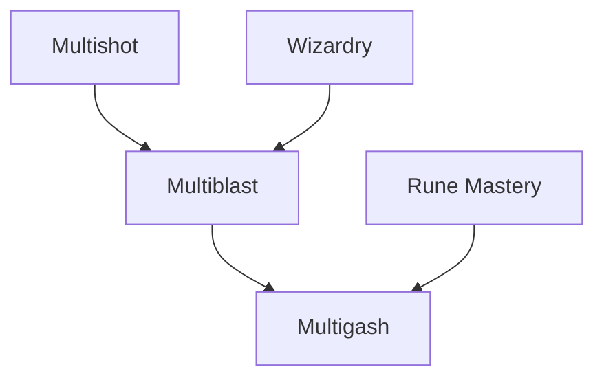

-  **Wizardry**
-  **Multishot**
-  **Multiblast**
-  **Rune Mastery**
-  **Multigash**

### Expansion → Materials → Multiplication

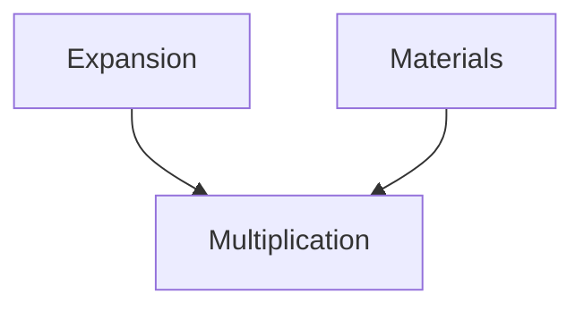

-  **Expansion**
-  **Materials**
-  **Multiplication**

### Aura → Clean Waters → No Pain

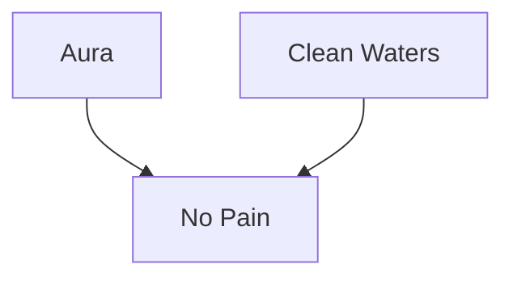

-  **Aura**
-  **Clean Waters**
-  **No Pain**

### Big Bang → Nucleus

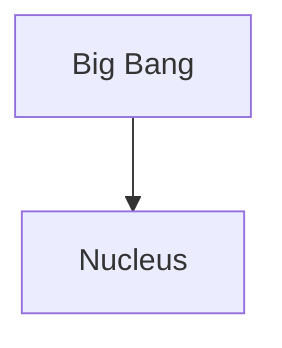

-  **Big Bang**
-  **Nucleus**

### Love → Lust → Passion

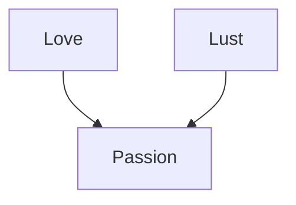

-  **Love**
-  **Lust**
-  **Passion**

### Sapiens → Angel Knowledge → Enlightenment → Learning Dew → Peace

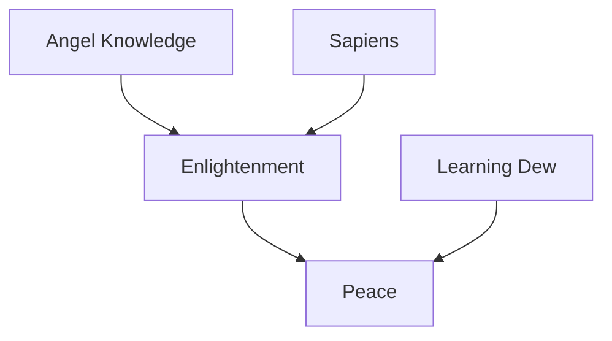

-  **Sapiens**
-  **Angel Knowledge**
-  **Enlightenment**
-  **Learning Dew**
-  **Peace**

### Sapiens → Angel Knowledge → Enlightenment → Rich Ghost → Fruit Reaper → Sleight of Hand → Phoenix

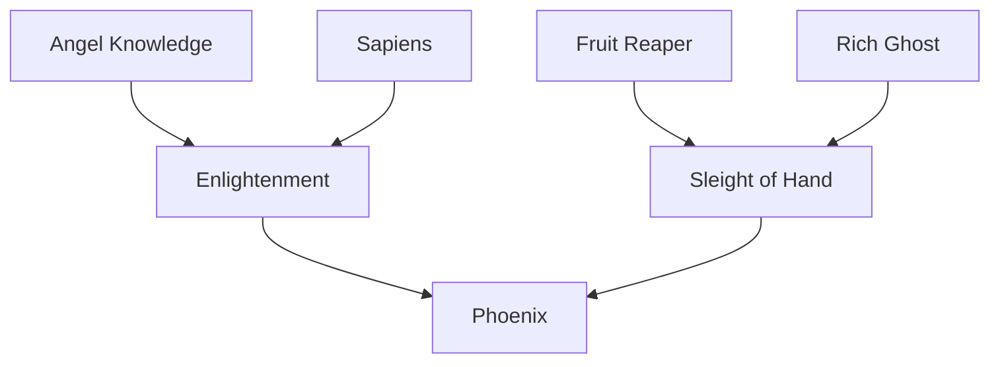

-  **Sapiens**
-  **Angel Knowledge**
-  **Enlightenment**
-  **Rich Ghost**
-  **Fruit Reaper**
-  **Sleight of Hand**
-  **Phoenix**

### Experiment → No Control → Rabid Beast

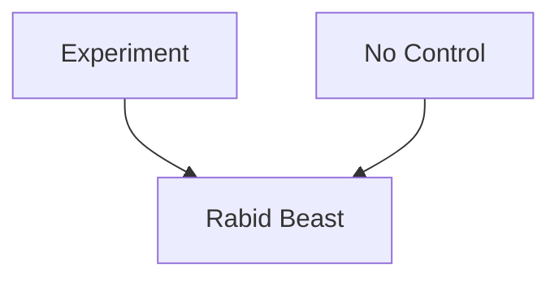

-  **Experiment**
-  **No Control**
-  **Rabid Beast**

### Pushing Flow → Wind Glove → Storm Glove

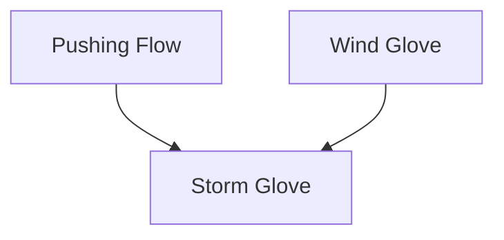

-  **Pushing Flow**
-  **Wind Glove**
-  **Storm Glove**

### Failed Experiment → Experiment → Final Experiment → Trident → Sword de Grâce

```mermaid
flowchart TD
  failed_experiment["Failed Experiment"]
  experiment["Experiment"]
  final_experiment["Final Experiment"]
  trident["Trident"]
  sword_de_grace@{ img: "./icons/sword-de-grace.png", label: "Sword de Grâce", pos: "b", h: 32, constraint: "on" }
  experiment --> final_experiment
  failed_experiment --> final_experiment
  final_experiment --> sword_de_grace
  trident --> sword_de_grace
```

-  **Failed Experiment**
-  **Experiment**
-  **Final Experiment**
-  **Trident**
-  **Sword de Grâce**
