# Desktop Defender — Crafting Guide

A simple crafting guide for Desktop Defender, showing what items to hold onto for crafting and what ingredients create which items.

After Rebirthing for the first time, you now unlock Forging. Clicking on this menu will allow you to combine two pieces of loot on the floor to make an even stronger piece of loot if they're part of a crafting recipe.

⚠️Items must be on the ground to be used in crafting, items equipped in any loot loadout will not be usable and must be dropped.

You can track items found, crafted, and recipes in your compendium.

## Table of contents

- [Ingredient items](#ingredient-items)
- [Crafted items](#crafted-items)
- [Craft progression](#craft-progression)
  - [Boson](#boson)
  - [Control](#control)
  - [Coup de Grâce](#coup-de-grâce)
  - [Dragonmade](#dragonmade)
  - [Golemification](#golemification)
  - [Holy Water Mend](#holy-water-mend)
  - [Light Mace](#light-mace)
  - [Matterless Arrows](#matterless-arrows)
  - [Moulded Deity](#moulded-deity)
  - [Moulded Lightning](#moulded-lightning)
  - [Multigash](#multigash)
  - [Multiplication](#multiplication)
  - [No Pain](#no-pain)
  - [Nucleus](#nucleus)
  - [Passion](#passion)
  - [Peace](#peace)
  - [Phoenix](#phoenix)
  - [Rabid Beast](#rabid-beast)
  - [Storm Glove](#storm-glove)
  - [Sword de Grâce](#sword-de-grâce)

## Ingredient items

Hold onto these items when they appear — they are used as crafting ingredients.

| Item | Used to craft |
| --- | --- |
|  Aerodynamics | Matterless Arrows |
|  Angel Knowledge | Enlightenment |
|  Aura | No Pain |
|  Big Bang | Nucleus |
|  Carved Arrows | Matterless Arrows |
|  Clean Waters | No Pain |
|  Deity Axe | Deity Staff, Moulded Blade |
|  Deity Saber | Deity Staff |
|  Deity Staff | Moulded Deity |
|  Demon | Demon's Sword |
|  Demon's Sword | Control |
|  Dragonborn | Dragonmade |
|  Druid's Sword | Demon's Sword |
|  Enlightenment | Peace, Phoenix |
|  Expansion | Multiplication |
|  Experiment | Final Experiment, Rabid Beast |
|  Failed Experiment | Final Experiment |
|  Final Experiment | Coup de Grâce, Sword de Grâce |
|  Fruit Reaper | Sleight of Hand |
|  Golem | Golemification |
|  Heavy Equipment | Light Mace |
|  Higgs Field | Boson |
|  Jupiter | Higgs Field |
|  Learning Dew | Peace |
|  Love | Passion |
|  Lust | Passion |
|  Materials | Multiplication |
|  Moulded Blade | Moulded Deity |
|  Moulded Will | Moulded Lightning |
|  Moulding Lava | Moulded Blade |
|  Multiblast | Multigash |
|  Multishot | Multiblast |
|  Musical Inspiration | Light Mace |
|  No Control | Control, Rabid Beast |
|  Pushing Flow | Storm Glove |
|  Rich Ghost | Sleight of Hand |
|  Rune Mastery | Multigash |
|  Sapiens | Enlightenment |
|  Sharp Shot | Coup de Grâce |
|  Sleight of Hand | Phoenix |
|  Trident | Sword de Grâce |
|  Ultimate Water Mend | Holy Water Mend |
|  Water Mend | Holy Water Mend, Ultimate Water Mend |
|  Wind Glove | Storm Glove |
|  Wind Golem | Golemification |
|  Wizardry | Multiblast |

## Crafted items

This is a list of items that must be crafted. Some of the items are used to further craft other items.

| Crafted item | Ingredient 1 | Ingredient 2 |
| --- | --- | --- |
|  Boson | Higgs Field | Higgs Field |
|  Control | Demon's Sword | No Control |
|  Coup de Grâce | Final Experiment | Sharp Shot |
|  Deity Staff | Deity Axe | Deity Saber |
|  Demon's Sword | Demon | Druid's Sword |
|  Dragonmade | Dragonborn | Dragonborn |
|  Enlightenment | Sapiens | Angel Knowledge |
|  Final Experiment | Failed Experiment | Experiment |
|  Golemification | Wind Golem | Golem |
|  Higgs Field | Jupiter | Jupiter |
|  Holy Water Mend | Water Mend | Ultimate Water Mend |
|  Light Mace | Musical Inspiration | Heavy Equipment |
|  Matterless Arrows | Aerodynamics | Carved Arrows |
|  Moulded Blade | Deity Axe | Moulding Lava |
|  Moulded Deity | Moulded Blade | Deity Staff |
|  Moulded Lightning | Moulded Will | Moulded Will |
|  Multiblast | Wizardry | Multishot |
|  Multigash | Multiblast | Rune Mastery |
|  Multiplication | Expansion | Materials |
|  No Pain | Aura | Clean Waters |
|  Nucleus | Big Bang | Big Bang |
|  Passion | Love | Lust |
|  Peace | Enlightenment | Learning Dew |
|  Phoenix | Enlightenment | Sleight of Hand |
|  Rabid Beast | Experiment | No Control |
|  Sleight of Hand | Rich Ghost | Fruit Reaper |
|  Storm Glove | Pushing Flow | Wind Glove |
|  Sword de Grâce | Final Experiment | Trident |
|  Ultimate Water Mend | Water Mend | Water Mend |

## Craft progression

Each diagram shows recipe steps for one path to a final crafted item. Arrows run from ingredients toward the item they combine into.

### Boson

 **Jupiter**
 **Higgs Field**
 **Boson**

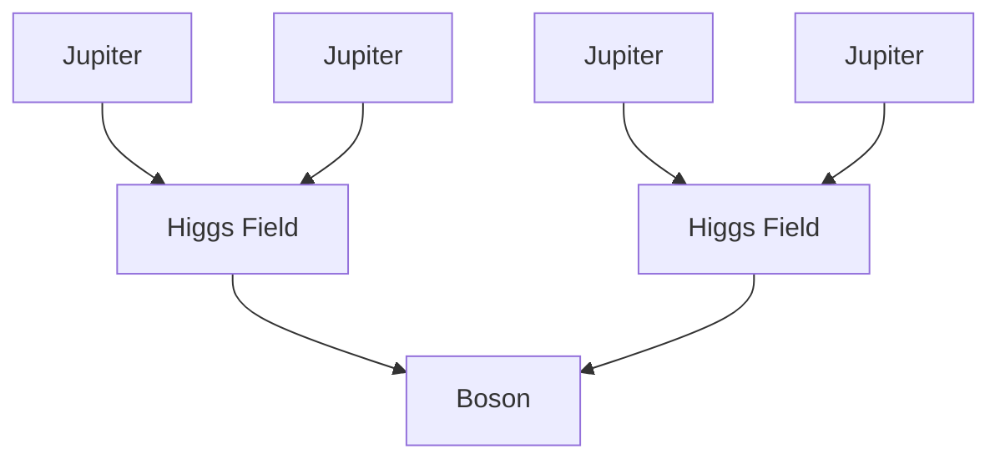

### Control

 **Demon**
 **Druid's Sword**
 **Demon's Sword**
 **No Control**
 **Control**

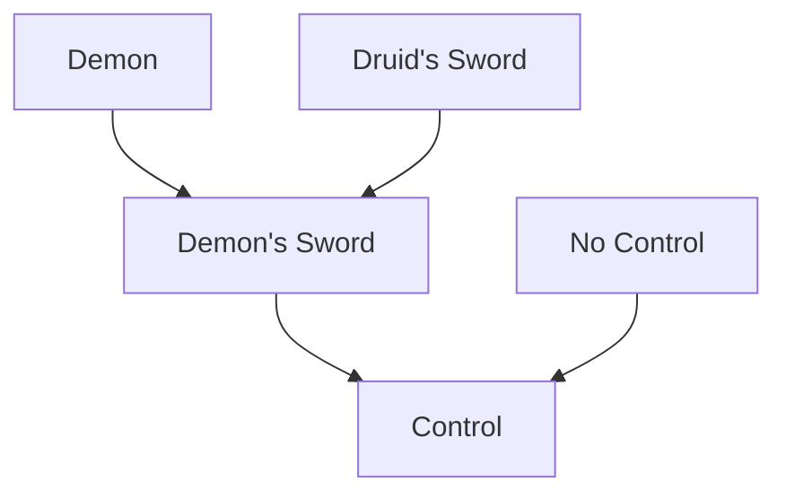

### Coup de Grâce

 **Failed Experiment**
 **Experiment**
 **Final Experiment**
 **Sharp Shot**
 **Coup de Grâce**

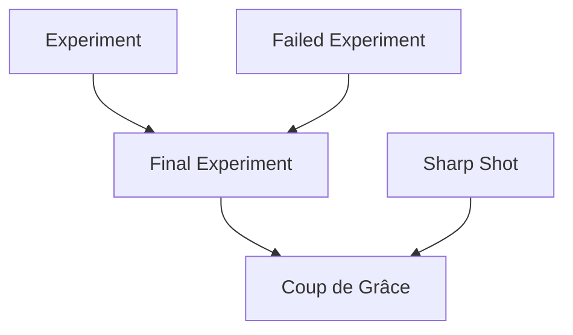

### Dragonmade

 **Dragonborn**
 **Dragonmade**

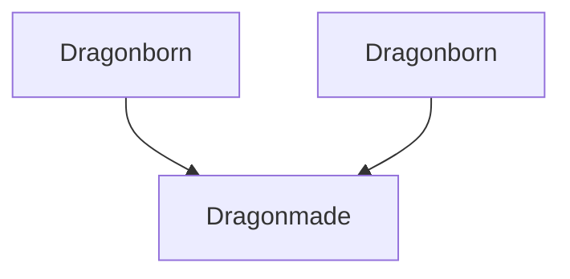

### Golemification

 **Wind Golem**
 **Golem**
 **Golemification**

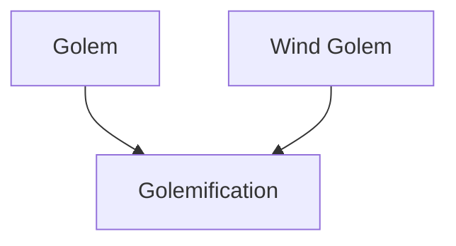

### Holy Water Mend

 **Water Mend**
 **Ultimate Water Mend**
 **Holy Water Mend**

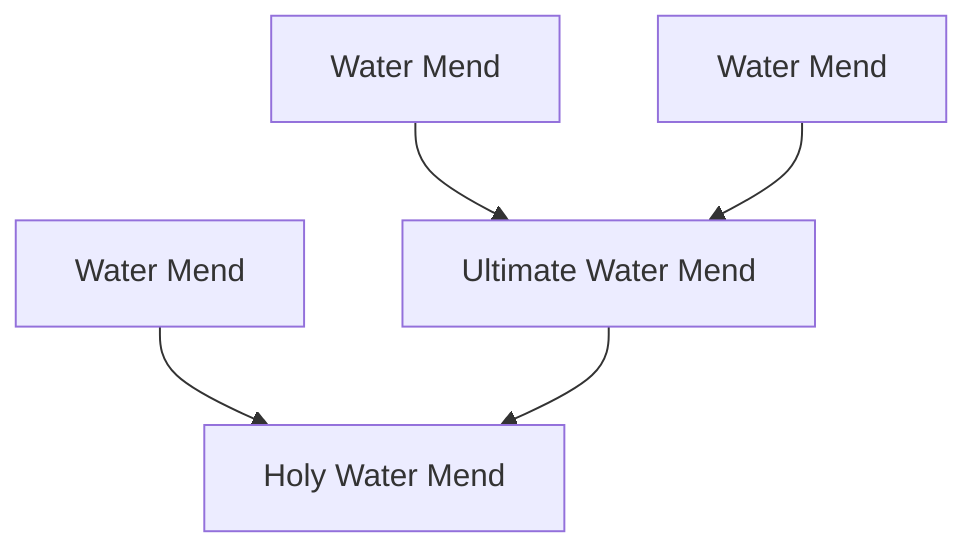

### Light Mace

 **Musical Inspiration**
 **Heavy Equipment**
 **Light Mace**

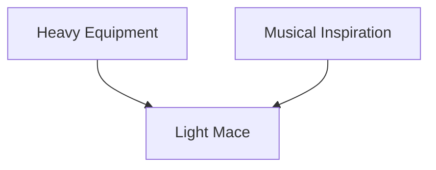

### Matterless Arrows

 **Aerodynamics**
 **Carved Arrows**
 **Matterless Arrows**

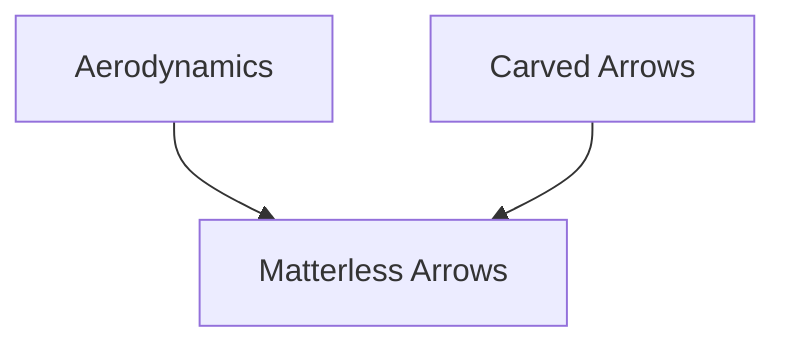

### Moulded Deity

 **Deity Axe**
 **Moulding Lava**
 **Moulded Blade**
 **Deity Saber**
 **Deity Staff**
 **Moulded Deity**

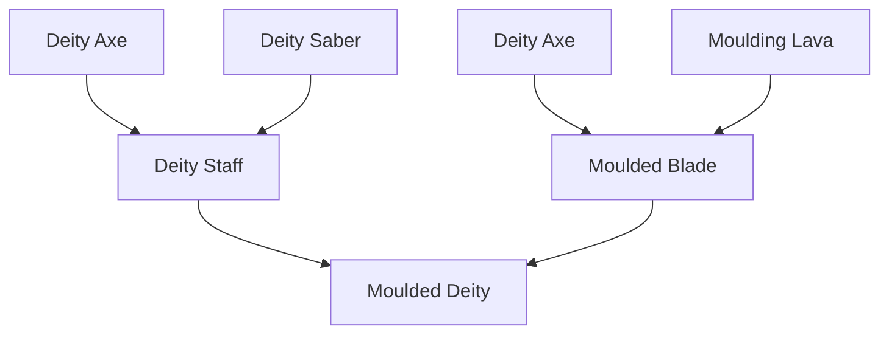

### Moulded Lightning

 **Moulded Will**
 **Moulded Lightning**

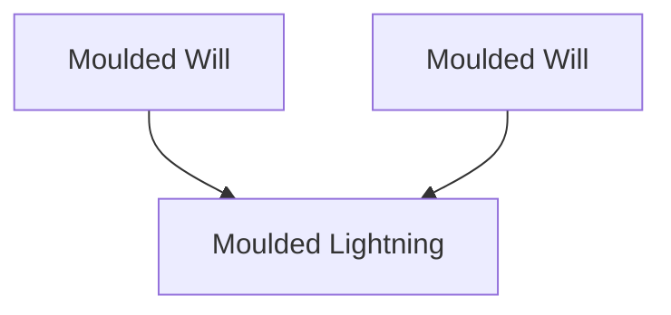

### Multigash

 **Wizardry**
 **Multishot**
 **Multiblast**
 **Rune Mastery**
 **Multigash**

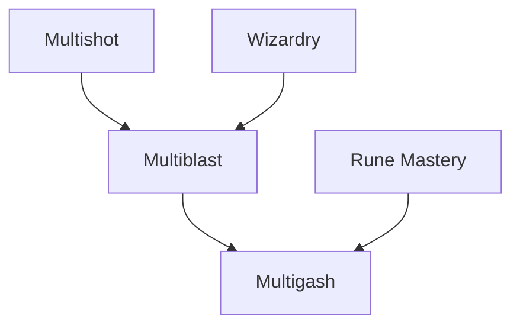

### Multiplication

 **Expansion**
 **Materials**
 **Multiplication**

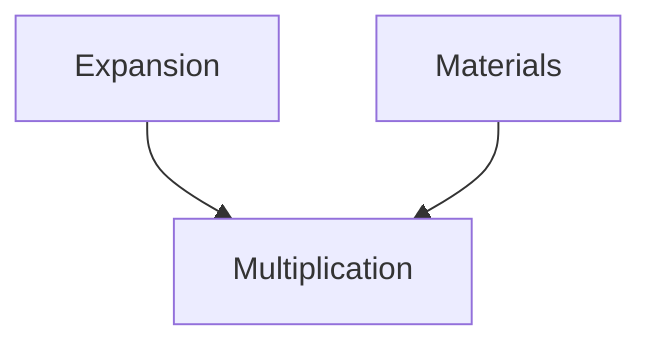

### No Pain

 **Aura**
 **Clean Waters**
 **No Pain**

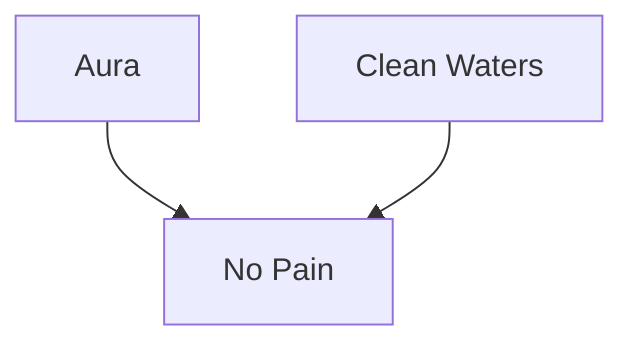

### Nucleus

 **Big Bang**
 **Nucleus**

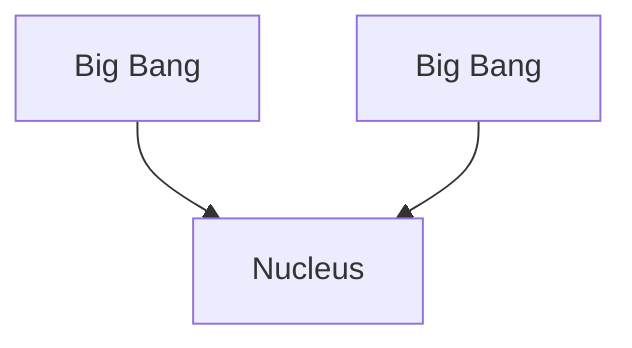

### Passion

 **Love**
 **Lust**
 **Passion**

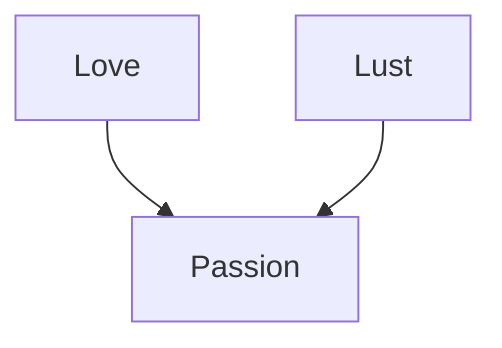

### Peace

 **Sapiens**
 **Angel Knowledge**
 **Enlightenment**
 **Learning Dew**
 **Peace**

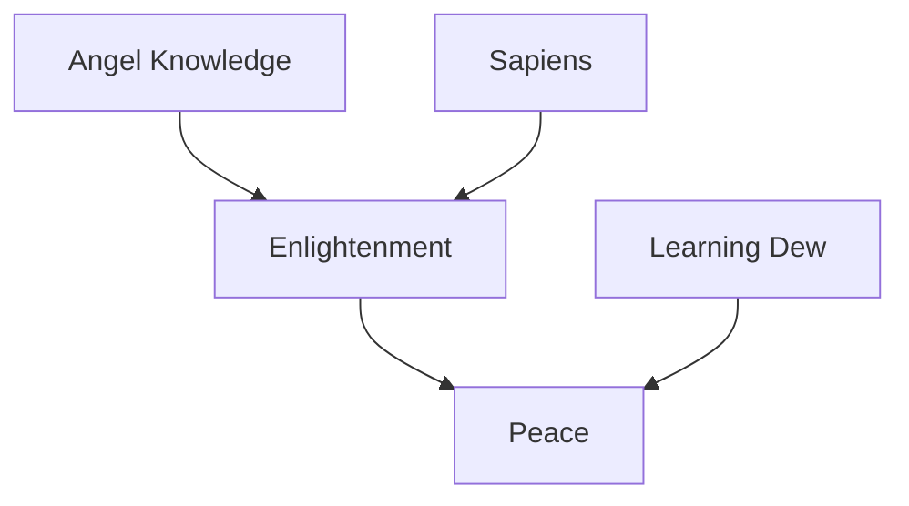

### Phoenix

 **Sapiens**
 **Angel Knowledge**
 **Enlightenment**
 **Rich Ghost**
 **Fruit Reaper**
 **Sleight of Hand**
 **Phoenix**

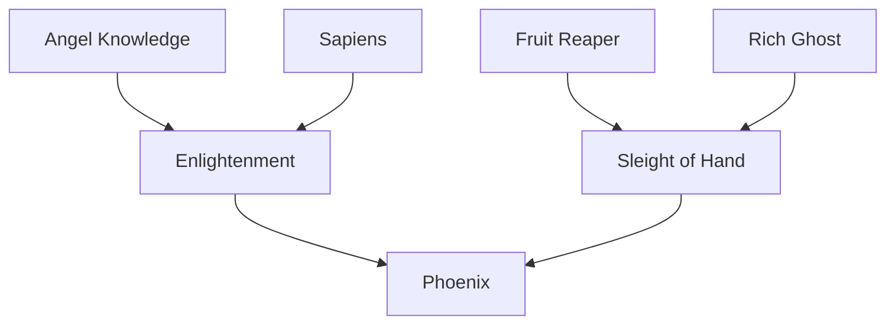

### Rabid Beast

 **Experiment**
 **No Control**
 **Rabid Beast**

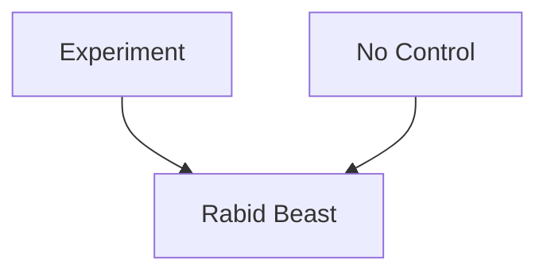

### Storm Glove

 **Pushing Flow**
 **Wind Glove**
 **Storm Glove**

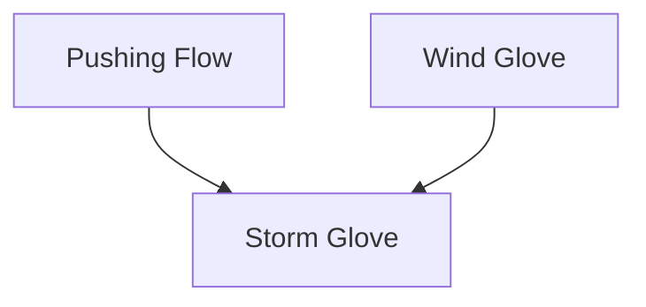

### Sword de Grâce

 **Failed Experiment**
 **Experiment**
 **Final Experiment**
 **Trident**
 **Sword de Grâce**

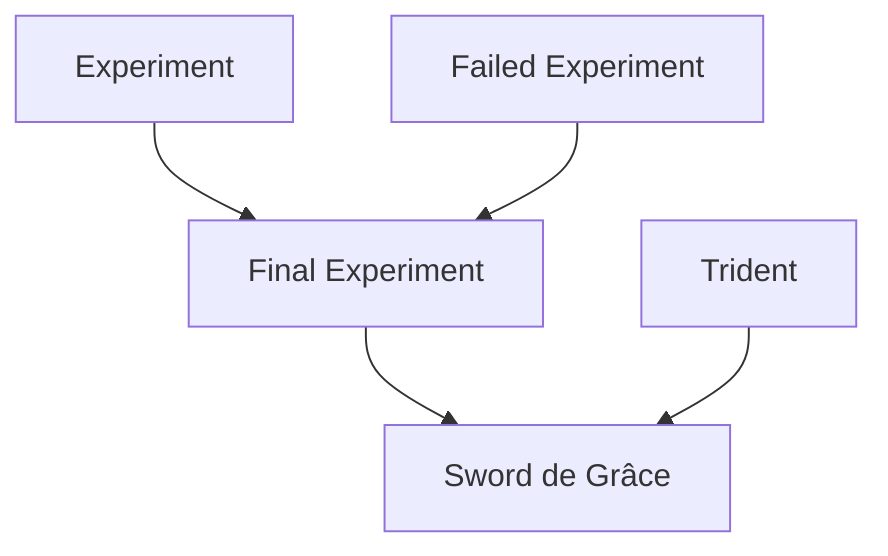
